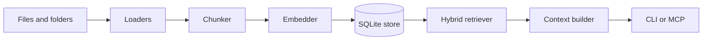

# ragkit

Local-first hybrid-RAG for your personal knowledge base. Indexes your docs,
notes, specs, and code repositories into SQLite (`sqlite-vec` + FTS5) with
Ollama embeddings, and serves them to AI agents over the Model Context Protocol
— 100% offline, no cloud.

## Pipeline



The core flow is intentionally simple: ingest local files, split them into
stable chunks, embed those chunks with Ollama, store everything in SQLite, then
blend vector and lexical retrieval when a query comes in.

## Local command aliases

After `npm install` and `npm run build`, you can avoid the long dist path and
invoke the CLI with either of these aliases:

```powershell
npm start -- init
npm run ragkit -- query "what am I looking for?"
```

`npm start` and `npm run ragkit` both point at the compiled CLI entrypoint in
`dist/cli/index.js`.

## Ollama setup

ragkit uses a local Ollama server for embeddings. If Ollama is not already
installed on your machine, set it up first:

1. Install Ollama for Windows from <https://ollama.com/download/windows>.
2. Start Ollama locally. You can launch the desktop app or run:

```powershell
ollama serve
```

3. Pull the embedding model used by ragkit:

```powershell
ollama pull nomic-embed-text
```

4. Verify the server is reachable:

```powershell
curl http://localhost:11434/api/tags
```

ragkit defaults to `http://localhost:11434`, so no env var is required unless
your Ollama server is running somewhere else.

## Offline guarantee

ragkit only talks to two local processes: SQLite on disk and Ollama on
`http://localhost:11434`. There is no hosted API, no sync service, and no
background upload path. If Ollama is unavailable, the CLI reports a local error
instead of reaching out to the network.

## Query explain mode

Use `ragkit query "..." --explain` when you want to see how the answer was
assembled. The explain output shows the dense and lexical candidate legs,
their ranks and raw scores, the RRF fusion step, and the final context budget
decisions that kept or dropped chunks.

## MCP server

`ragkit mcp` runs a Model Context Protocol server over stdio, exposing three
tools so an agent can search and read your indexed knowledge base:

- `search_context` — hybrid (vector + BM25) search returning cited passages.
- `list_collections` — available collections with document/chunk counts.
- `get_document` — full content of one indexed document by source path.

### Register with Claude

```powershell
claude mcp add --transport stdio ragkit --scope user -- npx -y ragkit mcp --collection pessoal
```

`--scope user` registers ragkit for every project (a transversal personal
knowledge base), not just the current repo. After registering, `/mcp` in Claude
should show `ragkit` as `connected`.

### JSON configuration

Equivalent `mcpServers` entry (e.g. `~/.claude.json` or a client's MCP config):

```json
{
  "mcpServers": {
    "ragkit": {
      "command": "npx",
      "args": ["-y", "ragkit", "mcp", "--collection", "pessoal"]
    }
  }
}
```

### Notes

- **stdout is protocol-only.** In `mcp` mode nothing but MCP frames is written
  to stdout; all diagnostics go to stderr. Do not pipe extra output into the
  process.
- **No hot reload.** Editing your files updates the index (`ragkit ingest`), but
  a running MCP client caches the tool list at connect time — restart the client
  (or its MCP connection) to pick up server changes.
- **Debugging a `disconnected` server:** run `ragkit mcp --collection <name>`
  directly in a terminal to see the real startup error on stderr.

See [`docs/mcp-setup.md`](docs/mcp-setup.md) for scopes, troubleshooting, and the
full protocol-purity contract.

## Backlog

The current deferred items live in [`docs/BACKLOG.md`](docs/BACKLOG.md):
pgvector, evals, HTTP API, and a web panel are intentionally out of MVP scope.
